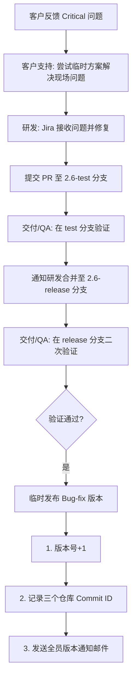
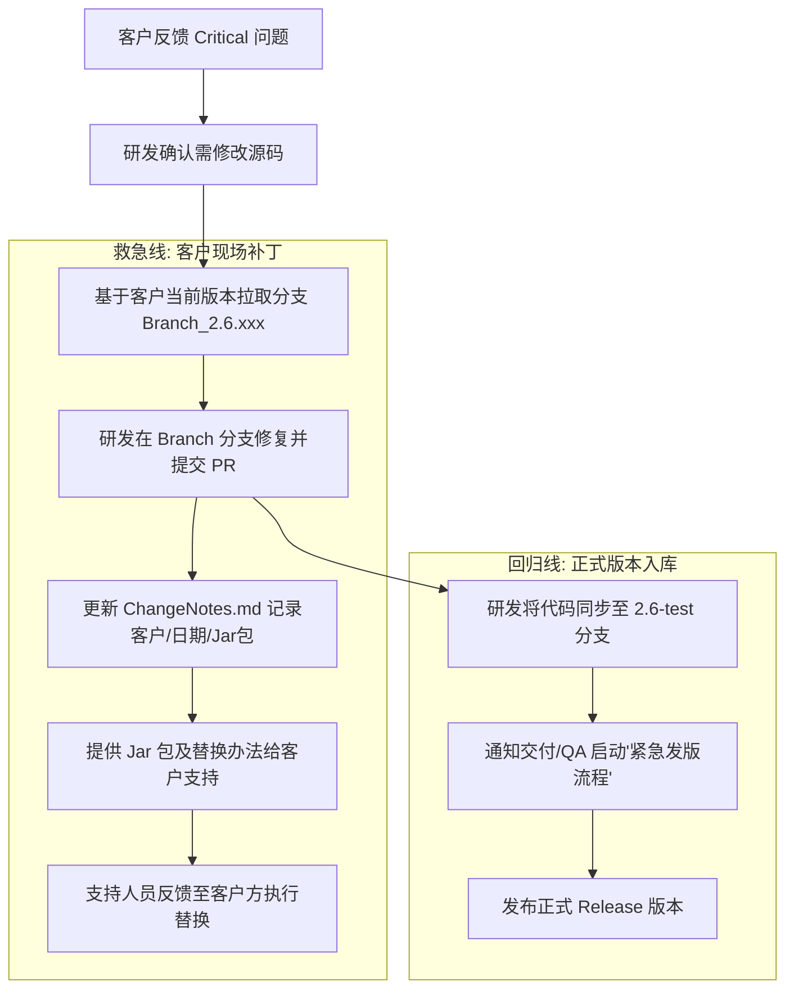

## 正常发版流程

```mermaid
graph TD
    A[客户反馈 Critical 问题] --> B[客户支持: 尝试临时方案解决现场问题]
    B --> C[研发: Jira 接收问题并修复]
    C --> D[提交 PR 至 2.6-test 分支]
    D --> E[交付/QA: 在 test 分支验证]
    E --> F[通知研发合并至 2.6-release 分支]
    F --> G[交付/QA: 在 release 分支二次验证]
    G --> H{验证通过?}
    H -- 是 --> I[临时发布 Bug-fix 版本]
    I --> J[1. 版本号+1]
    J --> K[2. 记录三个仓库 Commit ID]
    K --> L[3. 发送全员版本通知邮件]
```

## 紧急发版流程 

```mermaid
graph TD
    A[客户反馈 Critical 问题] --> B[客户支持: 尝试临时方案解决现场问题]
    B --> C[研发: Jira 接收问题并修复]
    C --> D[提交 PR 至 2.6-test 分支]
    D --> E[交付/QA: 在 test 分支验证]
    E --> F[通知研发合并至 2.6-release 分支]
    F --> G[交付/QA: 在 release 分支二次验证]
    G --> H{验证通过?}
    H -- 是 --> I[临时发布 Bug-fix 版本]
    I --> J[1. 版本号+1]
    J --> K[2. 记录三个仓库 Commit ID]
    K --> L[3. 发送全员版本通知邮件]
```

## 临时紧急发版流程 

```mermaid
graph TD
    A[客户反馈 Critical 问题] --> B[研发确认需修改源码]
    B --> C[基于客户当前版本拉取分支 Branch_2.6.xxx]
    
    subgraph 救急线: 客户现场补丁
    C --> D[研发在 Branch 分支修复并提交 PR]
    D --> E[更新 ChangeNotes.md 记录客户/日期/Jar包]
    E --> F[提供 Jar 包及替换办法给客户支持]
    F --> G[支持人员反馈至客户方执行替换]
    end
    
    subgraph 回归线: 正式版本入库
    D --> H[研发将代码同步至 2.6-test 分支]
    H --> I[通知交付/QA 启动'紧急发版流程']
    I --> J[发布正式 Release 版本]
    end
```

