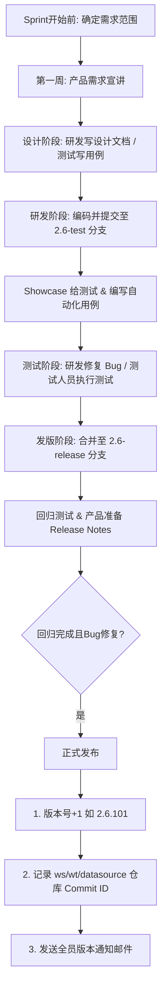
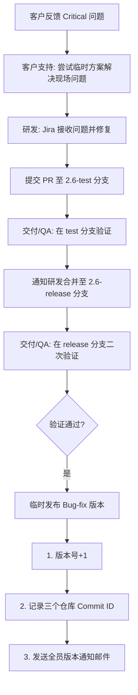
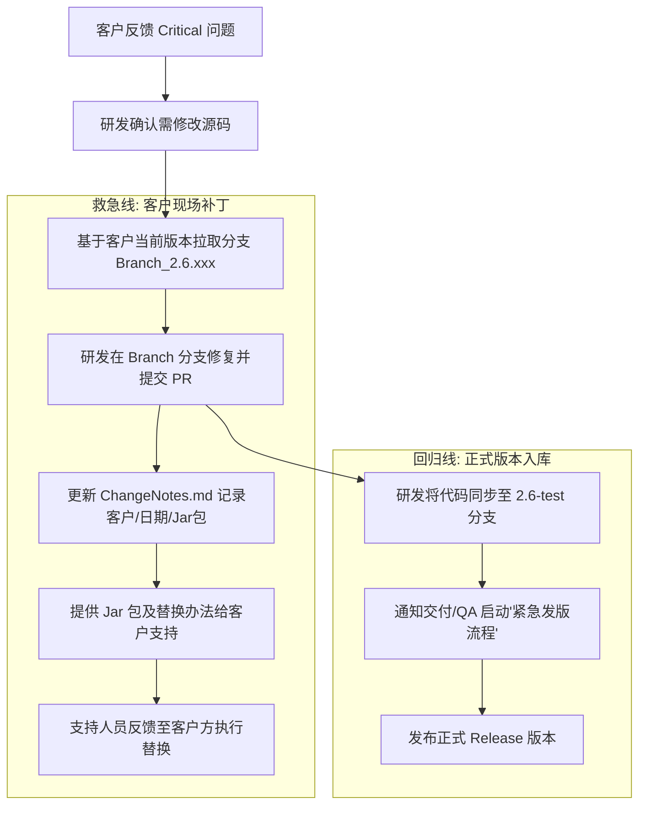

## 正常发版流程

```mermaid
graph TD
    A[Sprint开始前: 确定需求范围] --> B[第一周: 产品需求宣讲]
    B --> C[设计阶段: 研发写设计文档 / 测试写用例]
    C --> D[研发阶段: 编码并提交至 2.6-test 分支]
    D --> E[Showcase 给测试 & 编写自动化用例]
    E --> F[测试阶段: 研发修复 Bug / 测试人员执行测试]
    F --> G[发版阶段: 合并至 2.6-release 分支]
    G --> H[回归测试 & 产品准备 Release Notes]
    H --> I{回归完成且Bug修复?}
    I -- 是 --> J[正式发布]
    J --> K[1. 版本号+1 如 2.6.101]
    K --> L[2. 记录 ws/wt/datasource 仓库 Commit ID]
    L --> M[3. 发送全员版本通知邮件]
```

## 紧急发版流程 

```mermaid
graph TD
    A[客户反馈 Critical 问题] --> B[客户支持: 尝试临时方案解决现场问题]
    B --> C[研发: Jira 接收问题并修复]
    C --> D[提交 PR 至 2.6-test 分支]
    D --> E[交付/QA: 在 test 分支验证]
    E --> F[通知研发合并至 2.6-release 分支]
    F --> G[交付/QA: 在 release 分支二次验证]
    G --> H{验证通过?}
    H -- 是 --> I[临时发布 Bug-fix 版本]
    I --> J[1. 版本号+1]
    J --> K[2. 记录三个仓库 Commit ID]
    K --> L[3. 发送全员版本通知邮件]
```

## 临时紧急发版流程 

```mermaid
graph TD
    A[客户反馈 Critical 问题] --> B[研发确认需修改源码]
    B --> C[基于客户当前版本拉取分支 Branch_2.6.xxx]
    
    subgraph 救急线: 客户现场补丁
    C --> D[研发在 Branch 分支修复并提交 PR]
    D --> E[更新 ChangeNotes.md 记录客户/日期/Jar包]
    E --> F[提供 Jar 包及替换办法给客户支持]
    F --> G[支持人员反馈至客户方执行替换]
    end
    
    subgraph 回归线: 正式版本入库
    D --> H[研发将代码同步至 2.6-test 分支]
    H --> I[通知交付/QA 启动'紧急发版流程']
    I --> J[发布正式 Release 版本]
    end
```

